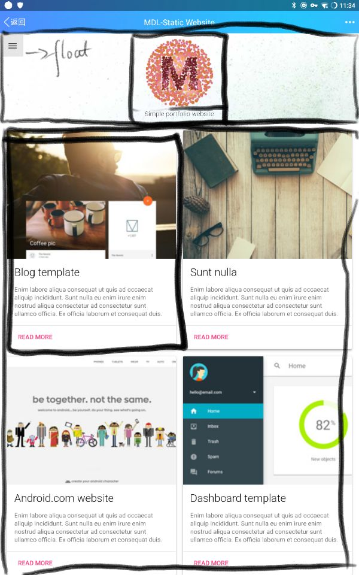

# my-github-page

## 说明

  这是个人博客首页（也可以理解为portfolio）。
  之前用的三驾马车直接开跑，有点累。故，准备利用Vue全家桶重新构造一个。用Markdown书写blog，然后经过加工处理成能放在GitHub Page上直接展示的文件。
  外观，整体上参考MaterialDesign给的Template-[portfolio](https://getmdl.io/templates/portfolio/index.html)，用Bootstrap实现。

## 开发环境

### webpack管理多个单页应用。

说来惭愧，还不太熟悉webpack，暂时就不弄了。这个主要是考虑到在Vue全家桶之下，可以在不同的域作多页的细分以及增量开发（后台加一个链接新页面就可以上线）。 ~~以后来优化吧。~~

## 流水记事

 目前，主要就portfolio和blog两个大的模块。
 主要考虑的是组件： 同页的组件和跨页的组件。 参考Vue所提及slot的用法。
 我觉得我还是需要jQuery的（没什么根据），所以需要掌握Vue的插件的用法[插件](https://cn.vuejs.org/v2/guide/plugins.html?#%E4%BD%BF%E7%94%A8%E6%8F%92%E4%BB%B6)

```js
export default function plugin(Vue, jQuery) {

  if (plugin.installed) {
    return;
  }
  plugin.installed = true;

  if (!jQuery) {
    console.error('You have to install jQuery');
    return;
  }

  Vue.jQuery = jQuery;

  Object.defineProperties(Vue.prototype, {

    jQuery: {
      get: function get() {
        return jQuery;
      }
    },

    $jq: {
      get: function get() {
        return jQuery;
      }
    }
  });
}
...
Vue.use(plugin,jQuery);
```

### 响应式设计

一般使用媒体查询（media query），但是这里Vue是数据驱动视图，所以引入Vuex（早晚都要用的）用来管理显示状态mainState。用于管理响应式的视图。window resize 当然需要 Debouncing and Throttling。有空再学习一下lodash的debounce。这里参考《高程3》的代码段：

```js
//据说《高程3》里的throttle应该是debounce
function debounce(method,context){
  clearTimeout(method.id);
  method.id = setTimeout(function(){
    method.call(context);
  },500);
}
```

我最开始使用jQuery一把梭，

```js
  beforeCreate: function() {
    function debounce(method, context) {
      clearTimeout(method.tId);
      method.tId = setTimeout(function() {
        method.call(context);
      }, 500);
    }
    function consoleWindow(e) {
      console.dir(e);
      console.log(
        "outerHeight: ",
        window.outerHeight,
        "outerWidth: ",
        window.outerWidth
      );
      // if (window.matchMedia("(max-width: 415px)").matches) {
      // } else {
      // }
    }
    (function(vue, $) {
      $(window)
        .on("resize.mobile", function(e) {
          debounce(consoleWindow);
        })
        .trigger("resize.mobile");
    })(this, this.jQuery);
  },
```

但是在Vue当中好似有更合适的角色来完成这件事：watch。
~~以后来优化吧。~~



利用《CSS揭秘》提示的flex方式完成stichy-footer。
